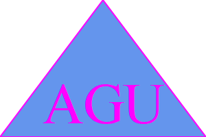
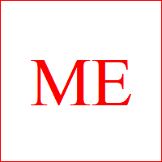
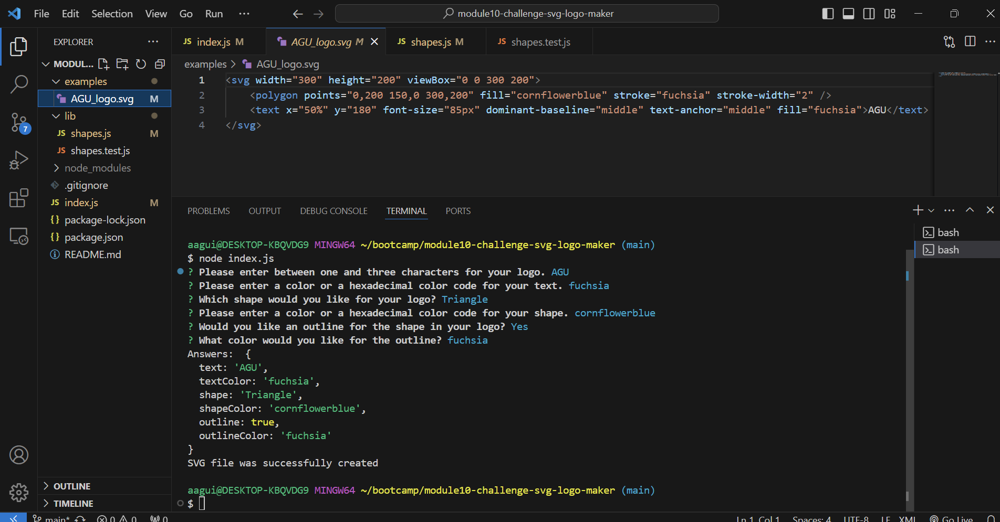

# SVG Logo Generator

### Creating an SVG logo image generator using Inquirer 8.2.4 and Jest

## Table of Contents

[Project Status](#project-status)

[Media of Application](#media-for-application)

[Purpose](#purpose)

[Installation](#installation)

[Usage](#usage)

[Credits](#credits)

[License](#license)

[Contributing](#contributing)

[Tests](#tests)

[Questions](#questions)

## Project Status

**Complete**

[GitHub Repository](https://github.com/aaguimond/module10-challenge-svg-logo-maker)

[Link to video showing the working application](N/A)

## Media for Application

  

[Link to video showing the working application](placeholder)

## Purpose

Adding visual flare to projects quickly and efficiently.

## Installation

Node.js and Inquirer version 8.2.4 are required for the application to run. I've also employed Jest in order to operate the testing suites.

## Usage

The application is initiated by typing "node index.js" within a terminal that's opened in the application folder. The only thing that's needed following that is to answer each of the questions that appear in the terminal. The application accepts both all of the color keyword defaults currently recognized by CSS, as well as any three or six character hexadecimal color code. The hexadecimal code must be preceded by a "#" in order to be recognized by the application.

## Credits

* Inquirer (version 8.2.4)
* Node.js
* Jest
* VS Code

## License

This project is licensed under the [MIT](https://opensource.org/licenses/MIT) license.

## Contributing

Please feel free to use the application code for any use within the bounds of the above license. I will also regularly check the repository for pull requests.

## Tests

Please see the "shapes.test.js" file for the testing suite. You must install Jest in order for the suite to operate.

## Questions

Please reach out to me with any questions:

- Github: [aaguimond](https://github.com/aaguimond)
- Email: aidanguimond2024@u.northwestern.edu